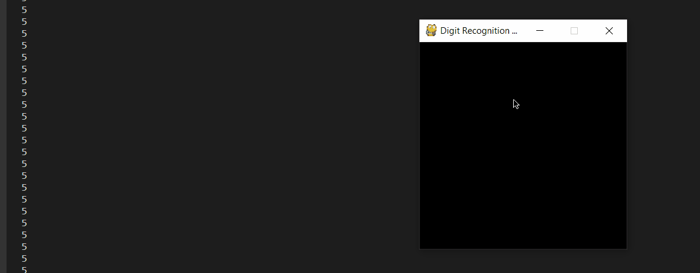
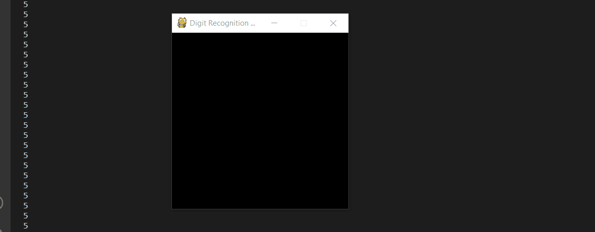
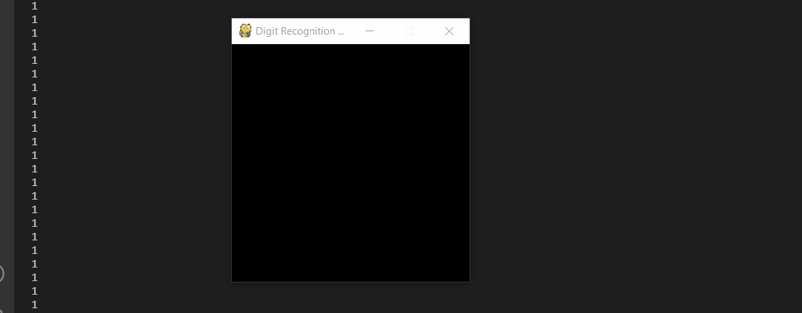

# Hand-Written-Digit-Recognition-Neural-Network

This Neural Network is able to recognize digits from 0 to 9 with acceptable accuracy. The repository also provides a pygame applet enabling users to interact with the Neural
Network. The MNIST handwritten number dataset was used to train this neural network.

## Applet controls :
 - left mouse button to draw on the screen.
 - right mouse button to erase the drawing.
 - middle mouse button to print the
   neural networks guess.
   
### Thing's to note when using the Applet :
 - The guess of the Neural Network depends on the positioning of the number
   for optimal result's drawing the number in the middle of the windos is recommended.
 - Draw the digit's in a bolded manner. This is because the dataset that was used
   to train the Neural Network.
 
## Demo's : 

